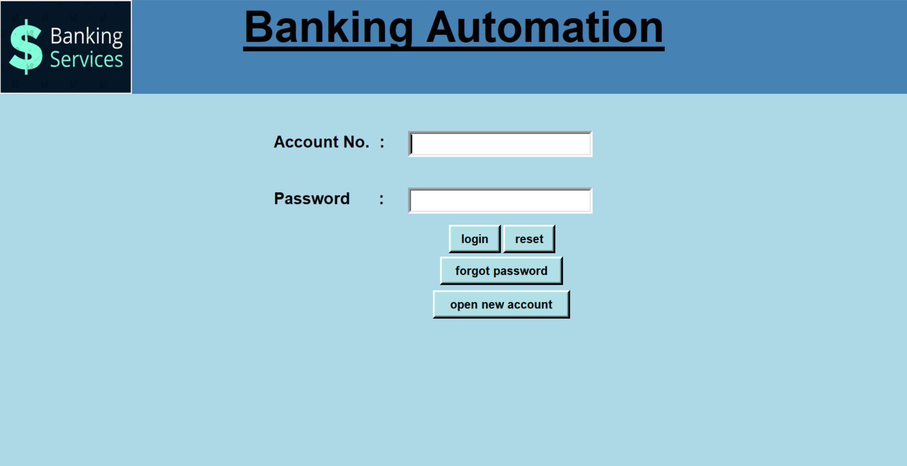

# Bank Automation



Banking Automation is a desktop application in which you can create account and manage transanctions.
This repository hosts a robust and user-friendly desktop application that simulates a real-world bank automation system. The project leverages Python for its core logic, Tkinter for an intuitive graphical user interface (GUI), and SQLite as a lightweight and efficient database management system for persistent data storage. The primary aim of this system is to provide a seamless interface for standard banking operations, enhancing the user experience and managing account data securely.

## Tech Used:

- Python with Tkinter

- SQLite.

## Usage:
- pillow
- Tkinter
- SQlite
- Datetime

```
$ pip install pillow
```
